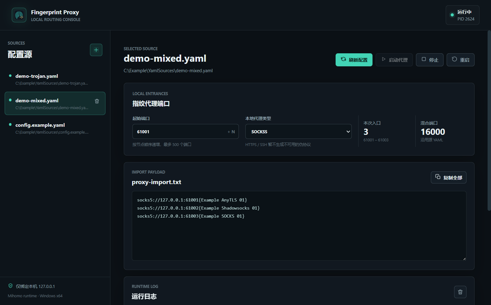

  

<h1 align="center">Fingerprint Proxy</h1>

  将本地 Clash / Mihomo YAML 转换为指纹浏览器可批量导入的本机 SOCKS5 或 HTTP 入口。

  
  
  
  
  

> 公开仓库不包含任何真实订阅、节点、账号、服务器或生成的代理导入内容。请先阅读 [隐私说明](docs/PRIVACY.md)。

## 它解决什么问题

指纹浏览器通常要求逐行导入独立代理，而 Clash/Mihomo 配置更适合作为规则与节点的统一配置。Fingerprint Proxy 在本机读取你选择的 YAML，为每个有效节点生成一个本地入口，例如：

    socks5://127.0.0.1:20001{Example Singapore 01}
    socks5://127.0.0.1:20002{Example United States 01}

程序将这些行写入 proxy-import.txt，并在界面中提供一键复制。它不会上传 YAML，不会请求订阅链接，也不会把管理接口暴露到局域网。

~~~mermaid
flowchart LR
  A[Clash Verge Rev 本地 YAML] --> B[Fingerprint Proxy]
  B --> C[本机 127.0.0.1 端口入口]
  C --> D[复制 proxy-import.txt]
  D --> E[指纹浏览器批量导入]
~~~

## 功能

- 选择本地 .yaml 或 .yml，支持多个配置源、快照和源文件变化检测。
- 保留源配置中的规则、DNS、代理组等内容，同时强制本机管理接口和监听器使用 127.0.0.1。
- 过滤流量、到期等元数据节点；跳过重复名称和无效节点；最多生成 500 个入口。
- 支持本地 SOCKS5 与 HTTP；HTTPS、SSH 选项明确禁用，不生成伪造格式。
- 刷新前使用 Mihomo 校验配置；失败时保留上一份可用配置和正在运行的服务。
- 运行中刷新只写入新配置并标记待重启，不会中断现有代理。
- 起始端口、TCP/UDP 端口冲突、DNS 与管理端口冲突均会检测。
- 界面显示导入文本、运行日志、服务状态和待重启状态。

## 安装

1. 前往 [GitHub Releases](https://github.com/kaosZL/fingerprint-proxy/releases) 下载最新的 `Fingerprint-Proxy-Setup-<version>.exe`。
2. 双击安装。安装器是 Windows x64 的当前用户安装包，不需要管理员权限。
3. Windows SmartScreen 可能提示未知发布者，因为当前版本没有代码签名。请只从本仓库的 Release 页面下载，并核对 Release 中给出的 SHA-256。
4. 安装完成后，从开始菜单或桌面启动 Fingerprint Proxy。

## 从 Clash Verge Rev 取出 YAML

Fingerprint Proxy 首版只导入本地 YAML，不接受机场订阅链接。这样可以避免订阅 URL 被复制到其他应用或 Git 仓库。

1. 在 Clash Verge Rev 的配置/Profile 页面更新并确认要使用的订阅。
2. 从 Profile 页面打开配置目录，或在 Windows 的 Profile 目录中找到当前的 YAML。Clash Verge Rev 的官方文档将 Profile 配置放在其应用数据目录下的 profiles 子目录。
3. 将选中的 .yaml 或 .yml 复制到一个仅本机使用的目录，例如 Documents 或其他不参与 Git 同步的位置。
4. 不要把该 YAML、截图中的节点信息、proxy-import.txt 或日志发到 GitHub、聊天群或工单。

在 Windows 的常见位置可从下面开始查找：

    %APPDATA%\io.github.clash-verge-rev.clash-verge-rev\profiles

不同安装渠道或版本的目录可能略有不同；优先使用 Clash Verge Rev 配置页提供的“打开目录”入口。

## 使用

1. 点击左侧加号，选择刚才复制出的 YAML。
2. 设置“指纹代理起始端口”，默认是 20001。每个节点依次占用一个端口。
3. 选择 SOCKS5 或 HTTP，然后点击“刷新配置”。
4. 确认节点数和端口范围，点击“复制全部”。
5. 在指纹浏览器的批量导入代理界面粘贴内容。每行对应一个节点入口。
6. 点击“启动代理”。状态变为“运行中”后再启动指纹浏览器环境。
7. YAML 在外部变更后，界面会提示重新读取；正在运行时刷新后点击“重启”才会应用新配置。

### 指纹浏览器导入格式

SOCKS5：

    socks5://127.0.0.1:20001{节点备注}

HTTP：

    http://127.0.0.1:20001{节点备注}

每次最多生成 500 行。备注会移除换行符、控制字符、花括号和方括号，避免批量导入格式被破坏。

## 本地文件

| 位置 | 作用 |
| --- | --- |
| %APPDATA%\FingerprintProxy\settings.json | 配置源、起始端口和协议设置 |
| %APPDATA%\FingerprintProxy\sources | YAML 快照 |
| %LOCALAPPDATA%\FingerprintProxy\runtime\active | 当前 config.yaml、proxy-import.txt 和运行时数据 |

点击窗口右上角的关闭按钮会将程序隐藏到系统托盘，代理服务会继续运行。右键系统托盘图标可选择“显示界面”或“退出”；选择“退出”时，程序会优雅结束自己启动的 Mihomo 进程，不会强制结束其他工具启动的 Mihomo 或 Clash Verge 进程。

## 隐私与安全

- 根目录中任何本机 YAML、proxy-import.txt、缓存和运行时二进制均在 .gitignore 中排除。
- [examples/config.example.yaml](examples/config.example.yaml) 是唯一公开示例，所有服务器均为 example.invalid，所有密码均为占位符，不能用作真实代理。
- 在提交前运行 <code>npm run privacy:check</code>。GitHub Actions 会重复执行这个检查。
- 如果提 Issue，请使用 <code>examples/config.example.yaml</code> 或经过彻底脱敏的最小复现文件。

## 从源码构建

要求：Node.js 22.12.0 或更高版本，以及 Windows x64。

    cd desktop-app
    npm ci
    npm run privacy:check
    npm test

要打出安装包，还需要将来自 Mihomo 官方项目的 mihomo.exe 和 geoip.metadb 放在仓库根目录。两项二进制保持忽略，不会提交到 Git：

    cd desktop-app
    npm run dist

输出为 desktop-app/release/Fingerprint-Proxy-Setup-<version>.exe。

## 版本、Release 与 Star 检测

- 发布版本使用语义化标签，例如 v1.0.0；每个公开版本在 GitHub Release 中提供安装器、blockmap 和 SHA-256。
- .github/workflows/ci.yml 在每次 push 与 pull request 执行隐私检查和测试。
- .github/workflows/star-monitor.yml 每日读取仓库 Star 数，更新 .github/star-monitor.json，并在达到 10、25、50、100 等里程碑时创建一条记录 Issue。
- README 顶部的 Star 徽章会显示当前仓库的公开 Star 数。

## 第三方组件与许可证

本应用源代码采用 [MIT License](LICENSE)。Windows Release 内含独立运行的 Mihomo 组件，Mihomo 采用 GPL-3.0，详见 [第三方声明](THIRD_PARTY_NOTICES.md) 与其上游源码。

## 维护

发布新版本前，请按 [Release Checklist](docs/RELEASING.md) 完成隐私检查、测试、打包、标签、Release 和哈希校验。
